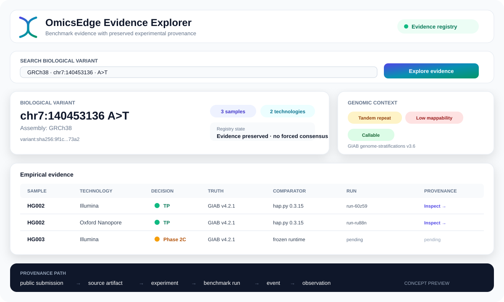
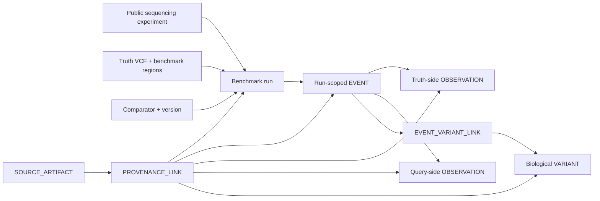
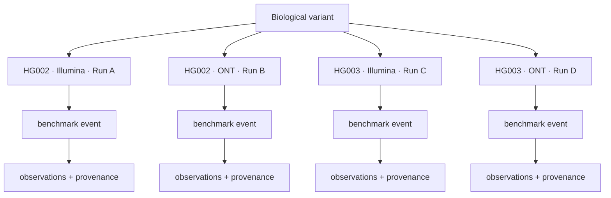
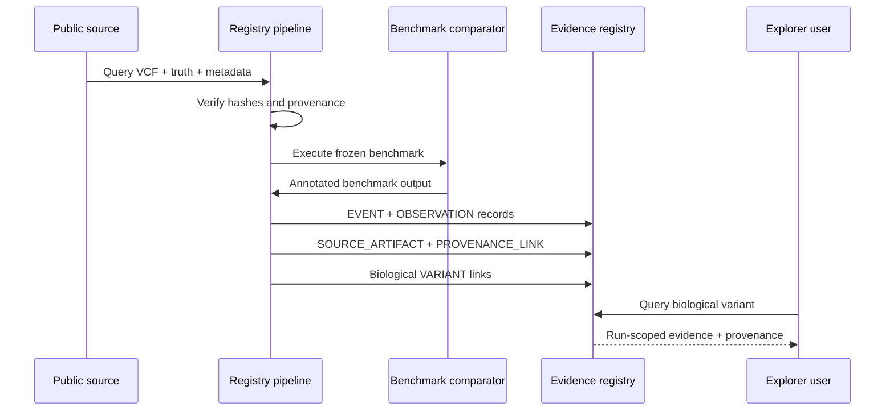
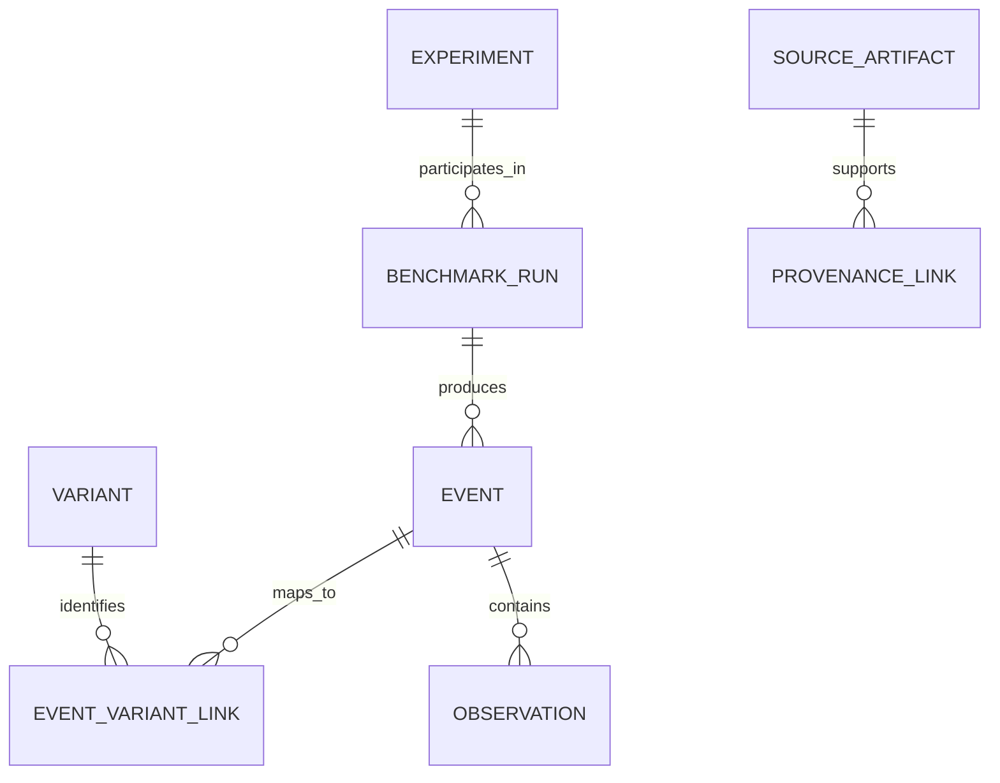
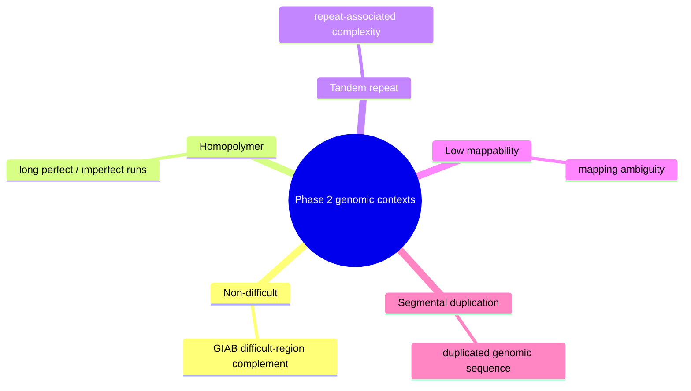
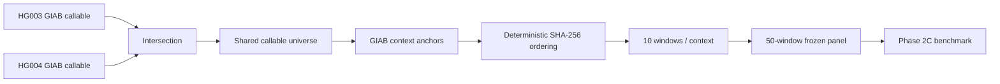
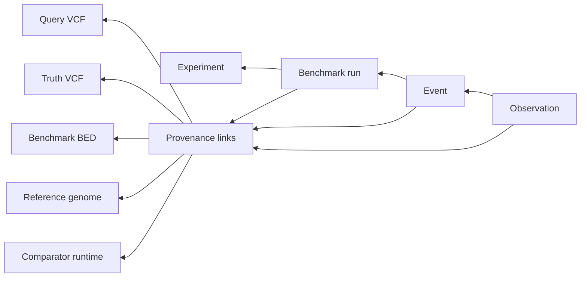
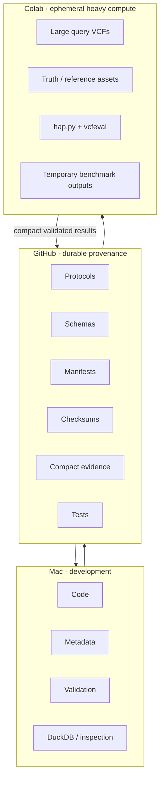

<div align="center">


<br>

### Traceable benchmark evidence across sequencing technologies, callers, samples, genomic contexts, and comparator versions.

**Project 003 · OmicsEdgeBio**

<br>

[](#project-status)
[](#phase-1a--empirical-proof-of-concept)
[](#phase-1b--biological-variant-identity)
[](#phase-2--generalization)
[](#)
[](#)

</div>

---

## What is this?

Most variant benchmarks answer a narrow question:

> **How well did this callset perform?**

The OmicsEdge Benchmark Evidence Registry asks a different question:

> **What empirical evidence exists for this biological variant across experiments, technologies, benchmark runs, genomic contexts, truth versions, and comparator versions - and exactly where did that evidence come from?**

The registry preserves the benchmark evidence itself rather than collapsing it immediately into a single score.

It is designed to make statements such as:

- this biological variant appeared in multiple independent benchmark runs,
- this Illumina observation was classified differently from an Oxford Nanopore observation,
- both observations originated from specific public submissions,
- the comparison used a particular GIAB truth release,
- the comparator implementation and version are known,
- the genomic context is traceable,
- and no unsupported consensus has been invented.

---

# Project dashboard

| Metric | Current state |
|---|---:|
| Project | **OmicsEdgeBio Project 003** |
| Phase 1A | ✅ PASS |
| Phase 1B | ✅ **15 / 15 gates PASS** |
| Phase 2 | ✅ **20 / 20 gates PASS** |
| Phase 2 release | ✅ Frozen and independently verified |
| Samples represented after Phase 2 | **HG002 · HG003 · HG004** |
| Sequencing technologies | **Illumina · Oxford Nanopore** |
| Phase 1 benchmark runs | **2** |
| Phase 1 events | **3,602** |
| Phase 1 observations | **7,204** |
| Phase 1 provenance links | **10,871** |
| Phase 1 biological variants | **1,666** |
| Phase 1 EVENT -> VARIANT links | **3,332** |
| Phase 2C benchmark events | **7,951** |
| Phase 2C observations | **15,902** |
| Phase 2D exact EVENT -> VARIANT links | **7,891** |
| Phase 2D unresolved events | **60** |
| Phase 2D biological variants touched | **2,612** |
| Phase 2 genomic contexts | **5** |
| Frozen Phase 2 windows | **50** |
| Phase 2 chromosomes represented | **19** |
| Phase 2 assessable bases | **1,162,571 bp** |
| Phase 2 query outcomes used during panel selection | **0** |
| Reliability / trust score | **Not generated** |
| Forced technology consensus | **Not generated** |

---

# Evidence Explorer preview

<p align="center">
  
</p>

<p align="center">
  <sub>
    Concept preview - the public Evidence Explorer will expose run-scoped observations,
    genomic context, and provenance without collapsing evidence into a single trust score.
  </sub>
</p>

---
---

# The core idea



The important separation is:

```text
VARIANT <- EVENT_VARIANT_LINK <- EVENT -> OBSERVATION
```

A biological variant can therefore accumulate evidence from multiple benchmark runs **without pretending that those benchmark events are identical**.

---

# Why this separation matters

A conventional benchmark may produce:

```text
Variant → PASS / FAIL
```

The evidence registry instead preserves:



These observations can coexist even when technologies or benchmark runs disagree.

The registry does **not** automatically turn them into:

```text
70% trustworthy
```

or:

```text
Illumina wins
```

or:

```text
Consensus = PASS
```

Those conclusions require separate scientific methods.

---

# Tool concept

The eventual public interface is intended to behave like an **evidence explorer**.

A user searches for a variant:

```text
chr7:140453136 A>T
```

and receives something conceptually like:

```text
┌──────────────────────────────────────────────────────────────┐
│ VARIANT                                                      │
│ GRCh38 · chr7:140453136 · A>T                               │
├──────────────────────────────────────────────────────────────┤
│ Evidence                                                     │
│                                                              │
│ HG002                                                        │
│   Illumina       ● TP     GIAB v4.2.1   hap.py 0.3.15       │
│   ONT            ● TP     GIAB v4.2.1   hap.py 0.3.15       │
│                                                              │
│ HG003                                                        │
│   Illumina       ● ...                                       │
│   ONT            ● ...                                       │
│                                                              │
│ HG004                                                        │
│   Illumina       ● ...                                       │
│   ONT            ● ...                                       │
├──────────────────────────────────────────────────────────────┤
│ Context                                                      │
│ tandem repeat · low mappability · callable                  │
├──────────────────────────────────────────────────────────────┤
│ Provenance                                                   │
│ submission → artifact → benchmark run → event → observation │
└──────────────────────────────────────────────────────────────┘
```

The final explorer will make each layer inspectable rather than hiding provenance behind a single summary number.

---

# Evidence journey



---

# Phase 1A - empirical proof of concept

**Status: PASS**

Phase 1A established that public benchmark output could be transformed into a provenance-preserving evidence registry.

The experiment used two public precisionFDA Truth Challenge V2 HG002 submissions:

| Dimension | Illumina | Oxford Nanopore |
|---|---|---|
| Sample | HG002 | HG002 |
| Submission | `60Z59` | `RU88N` |
| Platform | NovaSeq 6000 | PromethION R9.4 |
| Pipeline | RN-Illumina | PEPPER-DeepVariant |
| Assembly | GRCh38 | GRCh38 |
| Truth | GIAB v4.2.1 | GIAB v4.2.1 |
| Comparator | hap.py 0.3.15 | hap.py 0.3.15 |
| Matching engine | RTG vcfeval 3.12.1 | RTG vcfeval 3.12.1 |

Phase 1A produced:

```text
2 experiments
2 benchmark runs
3,602 run-scoped events
7,204 observations
10,871 provenance links
1,666 cross-run identity candidates
```

The original evidence remains run-scoped and immutable.

---

# Phase 1B - biological variant identity

**Status: PASS - 15 / 15 validation gates**

Phase 1B introduced a distinct biological `VARIANT` entity.



The frozen Phase 1 evidence produced:

```text
1,666 biological VARIANT entities
3,332 EVENT_VARIANT_LINK entities
1,666 cross-run relationships
```

All 1,666 Phase 1 candidates satisfied exact normalized allele identity under the frozen v1 method.

The identity decision uses:

```text
assembly
contig
normalized start
normalized end
REF
ALT
```

Deterministic IDs are content-derived using SHA-256.

### Representation equivalence

Representation equivalence is deliberately **not inferred**.

For example:

```text
left-aligned representation
vs.
alternate representation of the same local haplotype
```

is not automatically treated as biological identity.

Until a separately specified and validated representation-equivalence method exists, such relationships remain:

```text
UNRESOLVED
```

---

# Phase 2 - generalization

**Status: PASS - 20 / 20 final validation gates**

Phase 2 tested whether the evidence model generalizes beyond a single HG002 chr20 proof of concept.

The final Phase 2 release passed all **20 / 20 frozen validation criteria**.

Final Phase 2 evidence includes:

```text
3 benchmark samples: HG002, HG003, HG004
2 sequencing technologies: Illumina and Oxford Nanopore
5 genomic contexts
19 chromosomes
7,951 Phase 2C run-scoped EVENT records
15,902 Phase 2C OBSERVATION records
7,891 exact EVENT_VARIANT_LINK records
60 UNRESOLVED EVENT records
2,612 Phase 2D biological VARIANT identities touched
```

The final release was checksum-manifested, independently extracted, and independently verified.

Frozen Phase 2 sources:

```text
HG003 · Illumina
HG003 · Oxford Nanopore

HG004 · Illumina
HG004 · Oxford Nanopore
```

All source selection occurred **before benchmark performance inspection**.

---

## Genomic context panel

The Phase 2 panel uses official GIAB genome-stratifications v3.6.



Exactly five context definitions were frozen:

| Context | GIAB v3.6 stratification |
|---|---|
| Non-difficult | `GRCh38_notinalldifficultregions.bed.gz` |
| Homopolymer | `GRCh38_AllHomopolymers_ge7bp_imperfectge11bp_slop5.bed.gz` |
| Tandem repeat | `GRCh38_AllTandemRepeats.bed.gz` |
| Low mappability | `GRCh38_lowmappabilityall.bed.gz` |
| Segmental duplication | `GRCh38_segdups.bed.gz` |

---

## Frozen Phase 2 interval panel

The panel was selected using genomic coordinates and frozen GIAB regions only.

No query VCF content or benchmark outcome was consulted.

```text
50 windows
10 windows / context
19 chromosomes represented
chr20 excluded
1,162,571 assessable bp
```

The chromosome used for the original Phase 1 proof of concept - `chr20` - was deliberately excluded.



Selection constraints included:

```text
25 kb nominal windows
>= 5 kb assessable sequence
>= 5 chromosomes / context
<= 2 windows / chromosome / context
no within-context overlap
< 50% overlap across contexts
chr20 excluded
```

---

# Provenance model

Every piece of evidence should be traceable back through the chain that generated it.



This allows a future user to distinguish:

```text
same biological variant
```

from:

```text
same benchmark event
```

from:

```text
same comparator decision
```

from:

```text
same technology behavior
```

They are not assumed to be equivalent.

---

# What the registry intentionally does not do

The current scientific model does **not** generate:

| Not generated | Reason |
|---|---|
| Global trust score | Requires a separately validated model |
| Reliability score | Evidence preservation precedes scoring |
| Technology ranking | Benchmark context is conditional |
| Forced consensus | Discordant evidence remains observable |
| Caller ranking | Not a caller leaderboard |
| Representation equivalence | Requires separate validation |
| Clinical interpretation | Outside current scientific scope |

The registry is an **evidence layer**, not a decision engine.

---

# Repository architecture

```text
omicsedge-benchmark-evidence/
│
├── docs/
│   ├── scientific_scope.md
│   ├── evidence_semantics.md
│   ├── conceptual_schema.md
│   ├── phase1b/
│   └── phase2/
│
├── schemas/
│   ├── experiment.schema.json
│   ├── benchmark_run.schema.json
│   ├── event.schema.json
│   ├── observation.schema.json
│   ├── provenance_link.schema.json
│   └── variant.phase1b.schema.json
│
├── src/
│   └── benchmark_evidence/
│
├── scripts/
│   ├── phase1b/
│   └── phase2/
│
├── sql/
│   ├── event_evidence.sql
│   └── phase1b/
│
├── tests/
│
├── data/
│   ├── manifests/
│   ├── phase1b/
│   └── phase2/
│
├── results/
│   ├── phase1b/
│   └── phase2/
│
├── environment/
│
└── notebooks/
```

Large reconstructable genomic files are intentionally excluded from Git.

---

# Compute architecture

The project separates durable scientific artifacts from temporary heavy computation.



Raw Phase 2 VCFs and large comparator workspaces therefore do **not** need to remain permanently on the development machine.

---

# Reproducibility

Frozen scientific decisions are represented using:

```text
protocol documents
.lock files
SHA-256 manifests
source URLs
source checksums
deterministic identifiers
deterministic selection algorithms
schema validation
synthetic adversarial tests
independent reconstruction checks
```

Phase 1B deterministic reconstruction reproduced the identity entities byte-for-byte.

Important frozen Phase 2 artifacts include:

```text
docs/phase2/phase2_protocol.md
docs/phase2/phase2_protocol.lock

docs/phase2/interval_selection_method.md
docs/phase2/interval_selection_method.lock

data/phase2/admitted_sources.tsv
data/phase2/context_beds.tsv
data/phase2/context_beds_downloaded.tsv

data/phase2/selected_intervals.tsv
data/phase2/selected_assessable_segments.bed
data/phase2/interval_panel.lock

results/phase2/interval_selection_summary.json
```

---

# Query model

The product-facing query is intended to begin from biological identity:

```sql
SELECT *
FROM variant_evidence
WHERE variant_id = ?;
```

and return the evidence without destroying its experimental structure:

```text
VARIANT
 ├── EVENT
 │    ├── benchmark run
 │    ├── experiment
 │    ├── technology
 │    └── OBSERVATION
 │
 ├── EVENT
 │    ├── benchmark run
 │    ├── experiment
 │    ├── technology
 │    └── OBSERVATION
 │
 └── provenance
```

The same variant can therefore expose multiple independent empirical histories.

---

# Roadmap

```mermaid
flowchart LR

    A["Phase 1A<br/>Empirical registry"] -->|PASS| B["Phase 1B<br/>Variant identity"]

    B -->|15/15 PASS| C["Phase 2A<br/>Source expansion"]

    C --> D["Phase 2B<br/>Context + panel"]

    D -->|FROZEN| E["Phase 2C<br/>Expanded benchmarking"]

    E --> F["Phase 2D<br/>Identity expansion"]

    F --> G["Phase 2E<br/>Product validation"]

    G --> H["Evidence Explorer"]

    H --> I["Public release"]
```



Current position:

```text
Phase 1A  ████████████████████  PASS
Phase 1B  ████████████████████  PASS
Phase 2A  ████████████████████  PASS
Phase 2B  ████████████████████  PASS / FROZEN
Phase 2C  ████████████████████  PASS
Phase 2D  ████████████████████  PASS
Phase 2E  ████████████████████  20 / 20 PASS
Explorer  ░░░░░░░░░░░░░░░░░░░░  NEXT
```

---

# Local development

```bash
python -m pip install -e '.[dev]'
pytest
```

Phase-specific verification and reproducibility scripts live under:

```text
scripts/phase1b/
scripts/phase2/
```

---

# Data policy

The repository favors compact, reproducible artifacts.

Large public genomic resources are referenced by:

```text
source URL
artifact identity
release/version
checksum
retrieval provenance
```

rather than duplicated unnecessarily in Git.

Large Phase 2 computation is intended to occur in temporary compute environments, while validated compact evidence is retained.

---

# Scientific scope

Project 003 currently focuses on:

**germline small-variant benchmark evidence**

across multiple:

```text
samples
sequencing technologies
benchmark runs
genomic contexts
source artifacts
truth releases
comparator versions
```

The project is not currently intended to provide:

```text
clinical interpretation
variant pathogenicity
variant calling
patient-level analysis
technology purchasing recommendations
caller leaderboards
```

---

# Release, citation, and reuse

Project 003 is being prepared as the **OmicsEdge Benchmark Evidence Registry v1.0.0** research release.

For citation metadata, see:

- [`CITATION.cff`](CITATION.cff)

Original OmicsEdgeBio software code is released under the:

- [MIT License](LICENSE)

Public benchmark inputs, truth resources, source metadata, and derived materials may have separate source terms. See:

- [`THIRD_PARTY_DATA_NOTICE.md`](THIRD_PARTY_DATA_NOTICE.md)

The authoritative frozen Phase 2 release is:

- Archive: `results/phase2e/omicsedge_phase2_final_results.tar.gz`
- SHA-256: `186cbed74fa718a728f7a24b43d58118a308165fae385eb95cc4cb4444788ca3`
- Size: `8,708,768 bytes`
- Validation: **20 / 20 PASS**

The registry is a research resource and does not provide clinical interpretation, pathogenicity assessment, reliability scoring, technology ranking, or medical advice.

---

# Vision

The longer-term goal is a searchable empirical evidence layer where a researcher can ask:

> **What do public benchmark experiments actually show for this variant, under which conditions, and with what provenance?**

Instead of returning a black-box confidence number, the registry should expose the observations necessary for the researcher to inspect the evidence directly.

<div align="center">

### Evidence first. Provenance preserved. Conclusions remain inspectable.

**OmicsEdgeBio**

</div>
