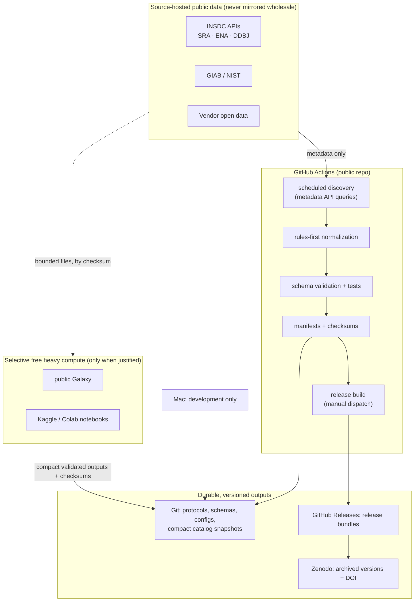

# Evidence Atlas — Zero-Cost Compute Architecture

Status: FROZEN / APPROVED (`FROZEN_APPROVED_BEFORE_M1_IMPLEMENTATION`, 2026-10-01). Locked by [`m0_expansion_protocol.lock`](m0_expansion_protocol.lock). Nothing is deployed or scheduled in M0.

## Goal

Operate at roughly **$0** recurring cost, with no dependence on the
developer's Mac as production compute. The Mac is for development only.

## Architecture

## Processing priority

The Atlas does **not** try to reprocess every public genome. In order of
preference:

1. **Existing public structured outputs** (metadata, published benchmark
   summaries);
2. **Existing VCF / benchmark outputs** (as in v1, which used public
   submission VCFs);
3. **Existing BAM/CRAM** when calls must be regenerated over a bounded region;
4. **FASTQ reprocessing** only when it is scientifically justified and
   documented in a frozen protocol, over bounded regions or samples.

Raw sequencing data stays at its source and is referenced by URI and
checksum. Only compact derived evidence is retained.

## Component responsibilities and realistic constraints

The limits below are what is understood as of M0. They change over time.
Each must be re-checked against the provider's current documentation when
the milestone that depends on it starts.

| Component | Use | Constraints to design for |
|---|---|---|
| GitHub Actions | Scheduled discovery, normalization, validation, tests, manifests, release builds | Free minutes on standard hosted runners for public repositories. Per-job time limit (≈6 h). Modest runner disk and RAM. Scheduled workflows can be delayed and are auto-disabled after prolonged repository inactivity. Workflow artifacts expire. Keep jobs metadata-sized and idempotent. |
| Git repository | Protocols, schemas, configs, compact catalog snapshots | Keep large files out of Git, as v1's `.gitignore` already does. No Git LFS dependence. Catalog snapshots stored compressed and sharded. |
| GitHub Releases | Release bundles | Per-asset size limit (≈2 GiB). Release bundles are compact evidence, not raw data. |
| Zenodo | Archival copy and DOI per release | Per-record size limits. Versioning under a concept DOI. Deposit is a deliberate, manual step. |
| INSDC / NCBI APIs | Metadata discovery | Rate limits: E-utilities allow ≈3 req/s without an API key and ≈10 req/s with a free key, stored as an Actions secret. Use polite back-off, incremental date-windowed queries and caching of unchanged records. |
| Public Galaxy | Occasional bounded comparator runs | Per-user storage and job quotas. Shared queues. Not for scheduled automation. Results must be exported with checksums and provenance. |
| Kaggle / Colab | Occasional bounded heavy jobs (as v1 used Colab) | Session time limits, weekly accelerator quotas, ephemeral disks. Every run must re-verify input checksums and emit a manifest. Results are not trusted until revalidated in GitHub Actions. |

## Operating rules

1. **Discovery is incremental.** Each scheduled run queries only records
   changed since the last snapshot and records the query and its response
   hash.
2. **Workflows are reproducible.** Pinned actions and container digests,
   recorded tool versions, and the frozen-input hash checks the v1 workflows
   already use.
3. **No secrets beyond free API keys.** No paid services or cloud egress.
4. **Heavy compute is opt-in per protocol.** It needs a frozen protocol, a
   bounded input list and an expected-output manifest before it runs.
5. **Failure is safe.** A failed discovery run leaves the previous catalog
   snapshot intact. A failed validation never produces a release.

Scheduling (cron) is introduced in M1, not M0.
