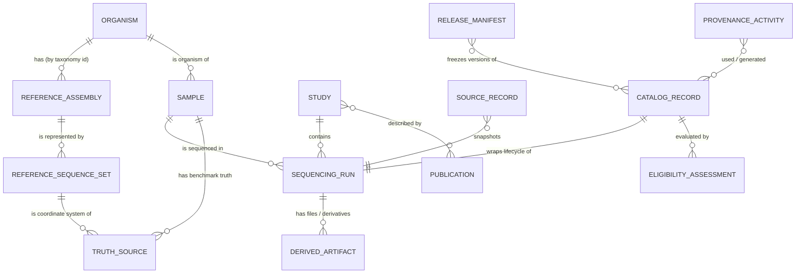

# Evidence Atlas — Universal Entity Model

Status: FROZEN / APPROVED (`FROZEN_APPROVED_BEFORE_M1_IMPLEMENTATION`, 2026-10-01). Locked by [`m0_expansion_protocol.lock`](m0_expansion_protocol.lock).

Schema family: `atlas-0.1.0`

Location: [`schemas/atlas/0.1.0/`](../../schemas/atlas/0.1.0/)

The expansion entity model sits **beside** the frozen v1 registry model
(`schemas/*.schema.json`, version `1.0.0`). It does not replace it. v1
entities (EXPERIMENT, BENCHMARK_RUN, EVENT, OBSERVATION, VARIANT,
EVENT_VARIANT_LINK, SOURCE_ARTIFACT, PROVENANCE_LINK) keep describing
benchmark evidence. The atlas-0.1.0 entities describe *what public data
exists, how it was normalized, and whether it may become evidence*. A later
milestone will define how a released atlas record feeds the v1-style evidence
entities. That mapping is not part of M0.

## Entities



| Entity | Schema | Identity | Purpose |
|---|---|---|---|
| ORGANISM | `organism.schema.json` | NCBI Taxonomy ID (`taxon:<id>`) | Taxon identity; names are labels. |
| REFERENCE_ASSEMBLY | `reference_assembly.schema.json` | INSDC `GCA_` accession.version | One assembly of one organism; RefSeq `GCF_` and UCSC names are aliases. |
| REFERENCE_SEQUENCE_SET | `reference_sequence_set.schema.json` | Atlas id | Concrete FASTA of an assembly (analysis set, ALT/decoy inclusion, contig naming). |
| STUDY | `study.schema.json` | BioProject (preferred) and/or INSDC study accession | Project grouping; umbrella projects are relations. |
| SAMPLE | `sample.schema.json` | BioSample accession | Biological sample, with aliases (e.g. HG002 / NA24385) carried with provenance. |
| SEQUENCING_RUN | `sequencing_run.schema.json` | INSDC run accession | One run of one library from one sample, with fully decomposed platform facets. |
| SOURCE_RECORD | `source_record.schema.json` | Atlas id + (source, accession, retrieved_at) | Immutable raw metadata snapshot with query, hash and terms. |
| PUBLICATION | `publication.schema.json` | DOI / PMID / PMCID | Literature linkage. |
| TRUTH_SOURCE | `truth_source.schema.json` | Provider + release + sample + assembly | Versioned benchmark/truth/comparator resource. |
| DERIVED_ARTIFACT | `derived_artifact.schema.json` | Atlas id + URI + checksum | File-level reads, alignments, calls, truth files or benchmark outputs. |
| PROVENANCE_ACTIVITY | `provenance_activity.schema.json` | Atlas id | PROV-style record of who/what used and generated which entities. |
| CATALOG_RECORD | `catalog_record.schema.json` | Atlas id + record_version | Lifecycle wrapper: layer, state, history, normalization, dedup, terms. |
| ELIGIBILITY_ASSESSMENT | `eligibility_assessment.schema.json` | Atlas id | Criterion-by-criterion evaluation under a policy version. |
| RELEASE_MANIFEST | `release_manifest.schema.json` | Semantic version | Authority for an immutable release's membership. |

Shared types live in `common.defs.schema.json`.

## Required-field coverage

| Requirement | Where |
|---|---|
| organism / NCBI taxonomy ID | `ORGANISM.ncbi_taxonomy_id`; `SAMPLE.organism` (normalized value) |
| sample / BioSample accession | `SAMPLE.biosample_accession` |
| study/project | `STUDY.accessions.{bioproject,insdc_study}` |
| run accession | `SEQUENCING_RUN.run_accession` (+ `experiment_accession`) |
| assay | `SEQUENCING_RUN.assay` |
| library strategy | `SEQUENCING_RUN.library.{strategy,source,selection,layout}` |
| reference assembly / assembly accession | `REFERENCE_ASSEMBLY.{assembly_name,insdc_accession,refseq_accession}`; `DERIVED_ARTIFACT.assembly_id`; `TRUTH_SOURCE.assembly_id` |
| technology family | `SEQUENCING_RUN.platform.technology_family` |
| vendor | `SEQUENCING_RUN.platform.vendor` |
| instrument family | `SEQUENCING_RUN.platform.instrument_family` |
| instrument model | `SEQUENCING_RUN.platform.instrument_model` |
| chemistry | `SEQUENCING_RUN.platform.chemistry[]` |
| read type | `SEQUENCING_RUN.read_type` (+ `platform.read_mode`) |
| basecaller/software | `SEQUENCING_RUN.basecaller`; `DERIVED_ARTIFACT.produced_by` |
| coverage where recorded | `SEQUENCING_RUN.coverage.{status,value}` |
| source database / source accession | `SOURCE_RECORD.{source_id,source_accession,canonical_accession,mirror_group_id}` |
| public file availability | `DERIVED_ARTIFACT.{availability,uri,size_bytes,checksum}`; `SEQUENCING_RUN.public_file_artifact_ids` |
| publication | `PUBLICATION`; `STUDY.publication_ids`; `TRUTH_SOURCE.publication_ids` |
| benchmark/truth source | `TRUTH_SOURCE` |
| derived artifact availability | `DERIVED_ARTIFACT.{origin,availability}` |
| provenance | `PROVENANCE_ACTIVITY`; `SOURCE_RECORD.query`; normalized-value `normalizer`/`ml`/`curation` |
| licensing/source terms | `source_terms` on SOURCE_RECORD, TRUTH_SOURCE, CATALOG_RECORD |
| discovery timestamp | `CATALOG_RECORD.{discovered_at,last_seen_at}`; `SOURCE_RECORD.retrieved_at` |
| normalization state | `CATALOG_RECORD.normalization_state` |
| normalization confidence | per field `normalized_value.confidence`; record-level `CATALOG_RECORD.normalization_confidence` |
| evidence eligibility state | `CATALOG_RECORD.{eligibility_state,layer,state_history}` |

## The normalized value

Every field that may need interpretation is stored as a `normalized_value`:

```json
{
  "raw_value": "PromethION",
  "value": "UNSPECIFIED",
  "method": "RULE_EXACT",
  "confidence": 1.0,
  "normalizer": {"id": "atlas-rules", "version": "0.1.0"}
}
```

- `raw_value` keeps the source string exactly, so normalization can be
  audited and re-run.
- `method` is one of `SOURCE_CONTROLLED`, `RULE_EXACT`, `RULE_PATTERN`,
  `CURATED`, `ML_PROPOSED`, `UNRESOLVED`.
- `ML_PROPOSED` **must** carry `ml.{model_id, model_version, input_sha256}`.
  `CURATED` must carry `curation.{curator, decided_at, rationale}`.
  `UNRESOLVED` must have `value: "UNKNOWN"` and `confidence: 0`.
- A hard-gate field can back eligibility only when its method is
  `SOURCE_CONTROLLED`, `RULE_EXACT`, `RULE_PATTERN` or `CURATED`. An
  `ML_PROPOSED` value is a proposal for review, never gate evidence
  (`CATALOG_RECORD.normalization_confidence.ml_only_hard_gate_fields` must be
  empty from `ELIGIBLE` onward).
- `UNKNOWN` means the value cannot be determined. `UNSPECIFIED` means the
  source deliberately gives only a coarser level, e.g. an instrument family
  with no model.

## Non-conflation rules (schema-enforced)

| Must not conflate | How the schema prevents it |
|---|---|
| species vs assembly | Separate entities. An assembly requires `ncbi_taxonomy_id` and a `GCA_` accession. A RefSeq accession is rejected in the INSDC slot. |
| assembly vs sequence set | REFERENCE_SEQUENCE_SET is a separate entity. TRUTH_SOURCE requires both `assembly_id` and `sequence_set_id`. |
| technology vs vendor vs instrument | `platform` requires six separate facets. A single platform string is rejected. |
| sample vs run | Separate entities. A run requires `sample_id`, and a BioSample accession is rejected as a run accession. |
| catalogued vs evidence | `CATALOG_RECORD` ties each state to exactly one layer. Candidate states require full normalization, canonical dedup status and compatible terms. `RELEASED` requires a release membership. |
| mirrored vs independent | SOURCE_RECORD carries `canonical_accession` and `mirror_group_id`. Counting is defined per mirror group. |
| derived vs source data | DERIVED_ARTIFACT has `origin` (`SOURCE_HOSTED`/`ATLAS_DERIVED`). Atlas-derived files require SHA-256, `produced_by` and at least one `derived_from`. |

Some rules need more than one record, such as state-history validity, outcome
aggregation and release semver. Those are enforced in
`src/evidence_atlas/protocol.py`.

## Versioning

Any schema change creates a new directory, `schemas/atlas/<new-version>/`,
with migration notes. Existing versions are never edited after they are
frozen. Every record declares `schema_version`.
