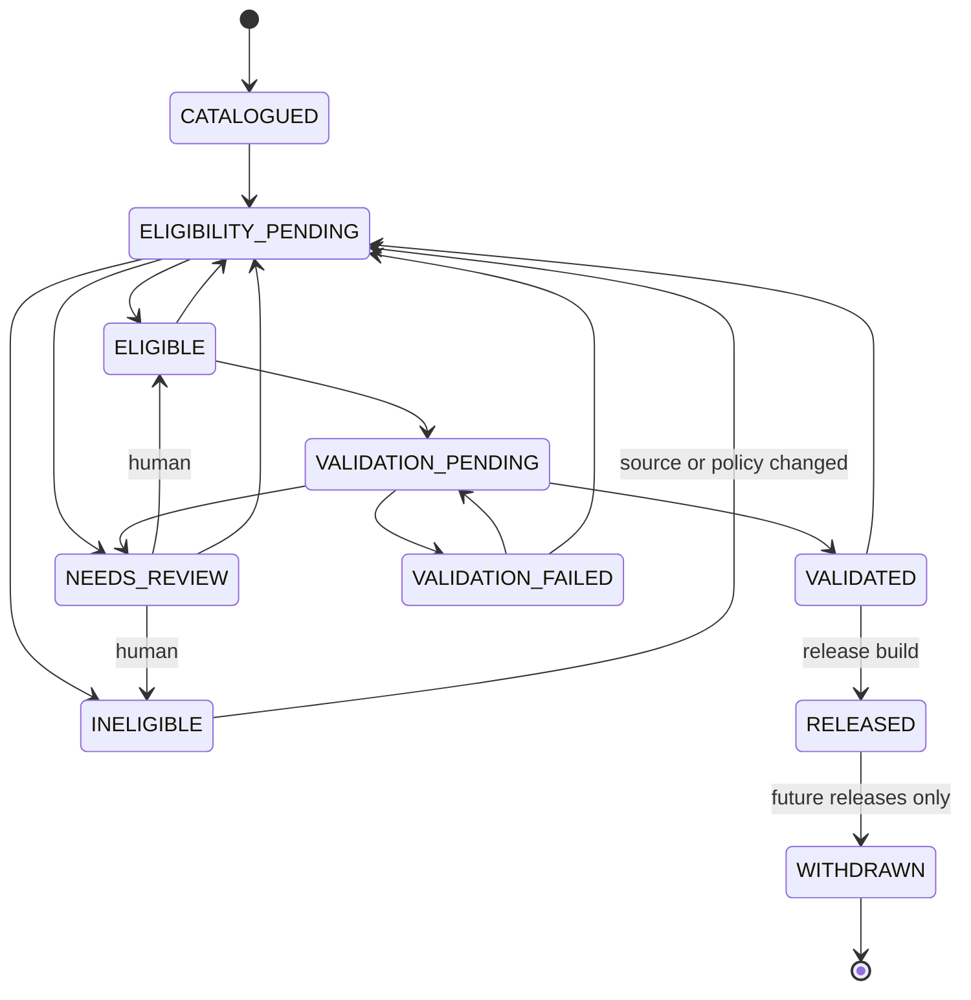

# Evidence Atlas — Evidence Eligibility Policy

Status: FROZEN / APPROVED (`FROZEN_APPROVED_BEFORE_M1_IMPLEMENTATION`, 2026-10-01). Locked by [`m0_expansion_protocol.lock`](m0_expansion_protocol.lock).

Machine-readable: [`config/atlas/eligibility_policy.json`](../../config/atlas/eligibility_policy.json) (policy 0.2.0)

Implementation: `aggregate_eligibility`, `evaluate_eligibility`,
`evaluate_e13`, `hard_gate_decision`, `validate_eligibility_assessment`,
`validate_catalog_record` and `state_history_errors` in [`src/evidence_atlas/protocol.py`](../../src/evidence_atlas/protocol.py)

## States and layers

| State | Layer | Meaning |
|---|---|---|
| `CATALOGUED` | Public Data Catalog | Discovered; metadata snapshotted. No scientific claim. |
| `ELIGIBILITY_PENDING` | Public Data Catalog | Queued for (re-)evaluation. |
| `INELIGIBLE` | Public Data Catalog | At least one hard criterion FAIL; kept with reasons. |
| `NEEDS_REVIEW` | Public Data Catalog | **Abstention.** A hard criterion is UNKNOWN or a normalization conflict exists. Never auto-promoted. |
| `WITHDRAWN` | Public Data Catalog | Source suppressed/withdrawn or terms changed. Excluded from future releases; past releases are untouched. Terminal. |
| `ELIGIBLE` | Evidence Candidate | Every hard criterion PASS (or NOT_APPLICABLE where conditional). |
| `VALIDATION_PENDING` | Evidence Candidate | Being processed under a frozen protocol. |
| `VALIDATION_FAILED` | Evidence Candidate | Failed a validation gate; kept with its report. |
| `VALIDATED` | Evidence Candidate | Passed validation; release-ready, **not yet released**. |
| `RELEASED` | Validated Release | Included in ≥1 immutable release manifest. |

`ABSTAIN` from the brief is represented by `NEEDS_REVIEW`. Two states were
added to the brief's list. `VALIDATION_FAILED` keeps "could not be validated"
distinct from "never eligible". `WITHDRAWN` records source suppression
without rewriting history.

## Transitions

(Every non-terminal state may also go to `WITHDRAWN`. Those edges are
omitted from the diagram.)

Structural guarantees, checked by `eligibility_policy_errors` and tested:

- `RELEASED` is reachable **only** from `VALIDATED`;
- `VALIDATED` is reachable **only** from `VALIDATION_PENDING`;
- `VALIDATION_PENDING` is entered only from `ELIGIBLE` or `VALIDATION_FAILED`;
- `CATALOGUED` can never jump to `ELIGIBLE`, `VALIDATED` or `RELEASED`;
- `WITHDRAWN` is terminal and `RELEASED` can only go to `WITHDRAWN`;
- the layers partition the states exactly.

History rules, checked per record:

- history starts `null → CATALOGUED`, is continuous and chronological, and
  ends at the current state;
- every eligibility decision references an `assessment_id`;
- leaving `NEEDS_REVIEW` for `ELIGIBLE`/`INELIGIBLE` needs a `HUMAN` actor;
- entering `RELEASED` needs a `RELEASE_BUILD` actor and a `release_version`;
- withdrawal never removes a past release membership.

A change to a released record's scientific content creates a **new record
version**. The released version is immutable.

## Eligibility criteria (all hard)

| ID | Criterion | Requirement |
|---|---|---|
| E01 | Stable public accession | INSDC run/sample/study accession or authoritative persistent ID; not suppressed. |
| E02 | Organism resolved | NCBI Taxonomy ID at species rank or below, by rule or curation. |
| E03 | Open access | Controlled-access data is INELIGIBLE. |
| E04 | Platform resolved | Technology family and vendor resolved; instrument family resolved or explicitly UNSPECIFIED without conflict. |
| E05 | Library in domain | Library strategy/source inside the target evidence domain (e.g. WGS/GENOMIC). |
| E06 | Assembly resolved | Assembly known by accession.version, or a defensible mapping path (see U3). |
| E07 | Usable provenance | Source query, retrieval time and raw snapshot SHA-256 recorded. |
| E08 | Public data available | ≥1 retrievable artifact with size and checksum. |
| E09 | Truth/comparator relationship *(conditional)* | Where the evidence domain needs it, a versioned truth resource exists for this sample and assembly. |
| E10 | Source terms compatible | Terms snapshotted and compatible with derived use/redistribution. |
| E11 | Reproducible transformation path | A frozen protocol exists for this evidence domain × technology family. |
| E12 | Deduplicated | Canonical member of its duplicate cluster. |
| E13 | Hard-gate fields authoritatively backed | Every hard-gate field is backed by authoritative source metadata (`SOURCE_CONTROLLED`), deterministic normalization of it (`RULE_EXACT`, `RULE_PATTERN`), or curator confirmation (`CURATED`), with no conflict. **An ML-only value never satisfies E13.** |

Hard-gate fields (`hard_gate_fields`): `ncbi_taxonomy_id`,
`technology_family_id`, `vendor_id`, `instrument_family_id`,
`library_strategy`, `library_source`, `assembly_id`, `sample_id`,
`access_class`.

E13 is never asserted by hand. `evaluate_eligibility` derives it from the
normalization method of each hard-gate value. A missing, unresolved or
ML-only value makes it `UNKNOWN`.

## Aggregation

Each criterion is decided `PASS`, `FAIL`, `UNKNOWN` or `NOT_APPLICABLE`.

1. Any hard `FAIL` → **INELIGIBLE**. A definite disqualifier dominates.
2. Else any hard `UNKNOWN` → **NEEDS_REVIEW**. The system abstains.
3. Else → **ELIGIBLE**.

`NOT_APPLICABLE` is accepted only for criteria marked `CONDITIONAL` (E09). An
assessment must evaluate every criterion exactly once, and its stored outcome
must equal the aggregation.

## ML and promotion

- **An ML-only value is never sufficient to promote a record to `ELIGIBLE`.**
  An `ML_PROPOSED` hard-gate value makes E13 `UNKNOWN` at any confidence, so an
  otherwise-eligible record aggregates to `NEEDS_REVIEW`.
- ML may propose values, assign confidence and route records to
  `NEEDS_REVIEW`. A curator who confirms a proposal records it as `CURATED`
  (curator, timestamp, rationale), and only then can it back a gate.
- Every eligibility assessment lists the method that backs each hard-gate
  field (`hard_gate_fields`). An assessment that claims E13 `PASS` with an
  ML-only or unresolved gate field is rejected. A `CURATED` field must carry a
  `curation_ref`.
- The schema rejects any `CATALOG_RECORD` in `ELIGIBLE` or a later state whose
  `ml_only_hard_gate_fields` is non-empty. ML-only gate values can exist only
  in the catalog layer.

## Policy changes

Changing criteria, thresholds or transitions requires a new `policy_version`.
Records in `INELIGIBLE`/`NEEDS_REVIEW` may then be re-queued
(`→ ELIGIBILITY_PENDING`). Released records are never re-judged in place.
