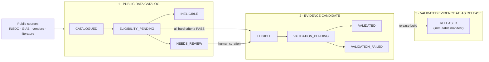

# M0 — Evidence Atlas Expansion Protocol

Status: FROZEN / APPROVED (`FROZEN_APPROVED_BEFORE_M1_IMPLEMENTATION`, 2026-10-01). Locked by [`m0_expansion_protocol.lock`](m0_expansion_protocol.lock).

Date: 2026-10-01

Milestone: M0 — Expansion protocol (frozen development milestone)

Next milestone: M1 — Automated Public Data Catalog (not started)

Applies to: every Evidence Atlas release after v1.0.0

Does not modify: Evidence Atlas v1.0.0 (Project 003), which is released and frozen

## 1. Purpose

Evidence Atlas v1.0.0 is a released, frozen, human-only resource. It covers
germline small-variant benchmark evidence for HG002, HG003 and HG004 on GRCh38,
using Illumina and Oxford Nanopore data.

The long-term goal is an Atlas that:

- is **species-agnostic** and **sequencing-technology-agnostic**;
- **discovers** public sequencing datasets broadly; and
- **admits** into versioned releases only datasets that are scientifically
  defensible.

M0 fixes the architecture and the scientific rules for that expansion before
any code ingests data. M0 ingests no data, downloads no reads, trains no
model, and deploys nothing.

## 2. Core rule

> **Catalogued is not validated evidence.**

A dataset can be catalogued without being comparable, eligible or validated.
Every surface (repository, website, announcements) must keep the three layers
in §3 distinct.

## 3. Three-layer architecture



| Layer | What a record there means | What it does NOT mean |
|---|---|---|
| Public Data Catalog | Metadata was discovered and snapshotted with provenance. | Comparable, eligible, or evidence. |
| Evidence Candidate | Every hard eligibility criterion passed under a stated policy version; may be undergoing validation. | Validated or released. |
| Validated Release | Passed a frozen protocol's validation gates and was frozen into an immutable, checksummed release manifest. | Truth, a ranking or a trust score. |

The authoritative definitions are machine-readable:
[`config/atlas/eligibility_policy.json`](../../config/atlas/eligibility_policy.json).

## 4. Document map

| Topic | Human-readable | Machine-readable |
|---|---|---|
| v1.0.0 immutability | [v1_immutability_policy.md](v1_immutability_policy.md) | [`releases/v1.0.0/`](../../releases/v1.0.0/) |
| Entity model | [entity_model.md](entity_model.md) | [`schemas/atlas/0.1.0/`](../../schemas/atlas/0.1.0/) |
| Source strategy | [source_strategy.md](source_strategy.md) | [`config/atlas/sources.json`](../../config/atlas/sources.json) |
| Technology taxonomy | [technology_taxonomy.md](technology_taxonomy.md) | [`config/atlas/technology_taxonomy.json`](../../config/atlas/technology_taxonomy.json) |
| Organisms and assemblies | [organism_assembly_model.md](organism_assembly_model.md) | [`config/atlas/organisms_assemblies.json`](../../config/atlas/organisms_assemblies.json) |
| Eligibility and lifecycle | [evidence_eligibility_policy.md](evidence_eligibility_policy.md) | [`config/atlas/eligibility_policy.json`](../../config/atlas/eligibility_policy.json) |
| ML policy | [ml_policy.md](ml_policy.md) | [`config/atlas/ml_policy.json`](../../config/atlas/ml_policy.json) |
| Compute architecture | [compute_architecture.md](compute_architecture.md) | — |
| Release model | [release_model.md](release_model.md) | [`release_manifest.schema.json`](../../schemas/atlas/0.1.0/release_manifest.schema.json) |
| Roadmap | [../roadmap.md](../roadmap.md) | — |
| Public progress | [../public_progress_policy.md](../public_progress_policy.md) | — |

The deterministic rules (state machine, eligibility aggregation, ML gate,
release invariants, v1 freeze check) are implemented once in
[`src/evidence_atlas/protocol.py`](../../src/evidence_atlas/protocol.py) and
tested in [`tests/atlas/`](../../tests/atlas/). Later milestones must call
these functions rather than re-implement them.

## 5. Design principles

1. **Freeze before compute.** Protocols, criteria and thresholds are fixed
   before the data they govern is inspected (as in v1 Phase 2).
2. **Identity is never a label.** Organisms are NCBI Taxonomy IDs, assemblies
   are accession.version, runs are INSDC run accessions.
3. **Facets are never conflated.** Species ≠ assembly; technology ≠ vendor ≠
   instrument model; sample ≠ run; catalogued ≠ evidence.
4. **Unknown is explicit.** `UNKNOWN` and `UNSPECIFIED` are values. They are
   never silently replaced by null or by a guess.
5. **Rules first, ML second, humans for ambiguity.** ML proposes, routes and
   abstains. An ML-only value never satisfies a hard eligibility gate, and ML
   never decides truth, validation, release inclusion, rankings or scores.
6. **Reference, don't copy.** Public data stays at its source. The Atlas stores
   metadata, checksums, provenance and compact derived evidence.
7. **Releases are immutable.** Continuous discovery feeds future releases. It
   never mutates a past one.
8. **No scores, rankings or consensus** without a separately specified and
   validated method. This is unchanged from v1.

## 6. Governance rules fixed by M0

**G1. ML cannot autonomously satisfy hard eligibility.** Every hard-gate
field must be backed by authoritative source metadata, deterministic
normalization of it, or curator confirmation before a record enters
`ELIGIBLE`. An ML-only value yields `NEEDS_REVIEW`. See
[ml_policy.md](ml_policy.md#the-hard-gate-rule).

**G2. ML thresholds are provisional and inactive.** The threshold values in
`ml_policy.json` are configuration placeholders, labelled PROVISIONAL /
INACTIVE / NOT VALIDATED / SUBJECT TO M2 CALIBRATION. **No ML model is
activated by M0.** Production thresholds will not be activated until M2
provides a frozen evaluation set, class-specific performance, a calibration
analysis, an abstention analysis, an error analysis and a threshold-selection
rationale. The config schema refuses activation without all six.

**G3. Only verified identifiers are frozen.** Every taxonomy ID, assembly
accession and UCSC name in the seed registry was verified by metadata-only
lookup, with stored provenance. No unverified identifier is admitted. See
[organism_assembly_model.md](organism_assembly_model.md#identifier-verification).

**G4. v1 freeze lineage is explicit.** The 467 frozen files are two lineages.
`scientific_release` is 197 files from tag `v1.0.0` (commit `c61b843`).
`web_delivery` is 270 files added later, up to commit `da19599`, as the
validated Evidence Explorer delivery for the frozen scientific release. The
web delivery does not alter the scientific observations. See
[v1_immutability_policy.md](v1_immutability_policy.md).

## 7. What M0 delivers

- an immutability policy with lineage-separated, checksummed manifests of the
  467 frozen v1 files (197 scientific-release + 270 web-delivery);
- verified seed organism/assembly identifiers with lookup provenance;
- 14 entity schemas plus shared definitions (JSON Schema 2020-12, family
  `atlas-0.1.0`);
- 5 controlled configurations (taxonomy, organisms/assemblies, sources,
  eligibility policy, ML policy) with their own schemas;
- a reference implementation of the deterministic protocol rules;
- tests that validate all of the above and reject protocol violations;
- a roadmap (M0–M6) and a public-progress policy.

## 8. Approval and locking

This protocol was approved on 2026-10-01 and is frozen with status
`FROZEN_APPROVED_BEFORE_M1_IMPLEMENTATION`.

[`m0_expansion_protocol.lock`](m0_expansion_protocol.lock) follows the
repository's existing `.lock` convention (`key=value` rows,
`<artifact>_sha256=` digests, a `status=FROZEN_…` row). It records the
SHA-256 of every approved M0 artifact:

- the protocol documents, roadmap and public-progress policy;
- the entity and configuration schemas;
- the controlled vocabularies and policies;
- the executable policy (`src/evidence_atlas/`) and the M0 scripts;
- the verified seed-identifier provenance;
- the v1 freeze/release metadata (`releases/v1.0.0/`).

The lock does **not** hash the frozen v1 scientific data itself. That data is
protected by `releases/v1.0.0/*.sha256`, which the lock pins. Tests and the
README are living files and are not locked, which matches the existing
convention. Verify with:

```bash
python scripts/atlas/freeze_m0_protocol.py --check
```

After the freeze, M0 artifacts are not edited in place. A change requires a
separately reviewed amendment, as the v1 phases did with their `*_patch.lock`
files: an amendment document, a version bump of the affected schema or
policy, a migration note, and a new lock. Live milestone progress is tracked
in the README, not in the locked roadmap.

## 9. Unresolved scientific decisions

These are deliberately left open. Each must be resolved, with a recorded
rationale, before the milestone named.

| # | Decision | Needed by |
|---|---|---|
| U1 | **Non-human truth.** GIAB-style benchmark truth sets are scarce for mouse, yeast and zebrafish. What counts as a truth/comparator relationship there (e.g. inbred-strain reference concordance, orthogonal-platform concordance, Mendelian consistency)? Until this is decided, criterion E09 cannot pass for those species. | M5 |
| U2 | **Evidence domains beyond germline small variants.** Do structural variants or other assay classes enter, and under which frozen comparator? | M4 |
| U3 | **Assembly cross-mapping.** Is liftover ever a "defensible mapping path" (E06), or must evidence be native to an assembly? v1 used native GRCh38 only. | M3 |
| U4 | **Vendor-produced data.** May vendor-generated benchmark data enter a release that compares technologies? If so, how is it flagged? | M4 |
| U5 | **Representation equivalence.** Still unresolved from v1. Cross-platform expansion raises its importance. | M4 |
| U6 | **ML thresholds.** No threshold is active. Production values must be chosen in M2 from the evaluation evidence listed under G2. The provisional placeholders carry no weight. | M2 |
| U7 | **Suppressed and superseded identifiers.** All seed identifiers are verified. NCBI reports the zebrafish RefSeq accessions as `suppressed` and the base GRCh37/GRCh38/GRCm38 versions as `previous`. Decide how records citing patch versions or suppressed RefSeq accessions map to registry assemblies, and whether newer assemblies (e.g. later zebrafish builds) are added. | M1 |
| U8 | **Taxonomy granularity.** Whether ONT kit chemistry, PacBio binding kits and basecaller models become controlled values or stay as recorded strings. | M2 |
| U9 | **Release identity across project names.** Whether expansion releases continue the v1 Zenodo concept DOI (as new versions) or start a new concept record. | M4 |
| U10 | **`PACBIO_HIFI` naming.** M0 models HiFi as a read mode of the `smrt` technology family, not as a family. The v1 `experiment.schema.json` enum includes `PACBIO_HIFI`. A mapping must be documented when v1-schema records are related to atlas-0.1.0 records. | M4 |
