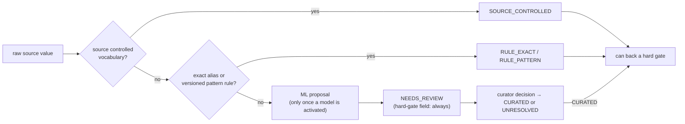

# Evidence Atlas — Machine Learning Policy

Status: FROZEN / APPROVED (`FROZEN_APPROVED_BEFORE_M1_IMPLEMENTATION`, 2026-10-01). Locked by [`m0_expansion_protocol.lock`](m0_expansion_protocol.lock). **M0 trains no model and activates no model.**

Machine-readable: [`config/atlas/ml_policy.json`](../../config/atlas/ml_policy.json) (policy 0.2.0)

Implementation: `ml_gate`, `ml_may_decide`, `hard_gate_decision`,
`evaluate_e13` and `evaluate_eligibility` in
[`src/evidence_atlas/protocol.py`](../../src/evidence_atlas/protocol.py)

## Principle

> Rules first. ML can **propose and route** metadata. It never **promotes**
> a record on its own authority, and it never decides truth.

## What ML MAY do

| Task | Output |
|---|---|
| Propose normalized metadata (e.g. instrument names) | `ML_PROPOSED` value with confidence and model provenance |
| Metadata entity resolution | Proposed links between sample aliases, studies, publications |
| Study classification | Proposed assay / evidence-domain class |
| Duplicate detection | Proposed duplicate clusters beyond exact-accession rules |
| Benchmark-suitability triage | Review **priority** only |
| Anomaly detection | Flags for implausible metadata |
| Review routing | Send a record to `NEEDS_REVIEW` with the proposal and its confidence |

## The hard-gate rule

**An ML-only value never satisfies a hard eligibility criterion.**

The eligibility policy names the fields that hard criteria depend on. These
are the *hard-gate fields*: `ncbi_taxonomy_id`, `technology_family_id`,
`vendor_id`, `instrument_family_id`, `library_strategy`, `library_source`,
`assembly_id`, `sample_id` and `access_class`. Before a record can enter
`ELIGIBLE`, every hard-gate field must be backed by one of:

| Backing | Normalization method |
|---|---|
| Authoritative source metadata | `SOURCE_CONTROLLED` |
| Deterministic normalization of authoritative metadata | `RULE_EXACT`, `RULE_PATTERN` |
| Explicit curator/human confirmation | `CURATED` (with curator, timestamp, rationale) |

An `ML_PROPOSED` value makes criterion E13 `UNKNOWN` **at any confidence and
whether or not thresholds are active**. The record therefore aggregates to
`NEEDS_REVIEW`, never to `ELIGIBLE`. If a curator confirms the proposal, the
value is re-recorded as `CURATED`, and only then can it back the gate.

This is enforced in four places:

1. **Config:** `hard_gate_accepted_methods` cannot contain `ML_PROPOSED` or
   `UNRESOLVED` (schema and integrity check).
2. **Executable policy:** `evaluate_eligibility` derives E13 from the
   hard-gate values and refuses a caller-supplied E13.
   `validate_eligibility_assessment` rejects an assessment that claims E13
   `PASS` while recording an ML-only gate field.
3. **Records:** `CATALOG_RECORD` in any state from `ELIGIBLE` onward must have
   an empty `ml_only_hard_gate_fields` (schema).
4. **Tests:** for each of the nine hard-gate fields, an otherwise-eligible
   record with that field ML-only, at confidence 1.0 and with a synthetic
   activated threshold it would clear, evaluates to `NEEDS_REVIEW`.

## What ML MUST NOT decide

| Decision | Why |
|---|---|
| A hard eligibility gate | Requires authoritative metadata, deterministic normalization of it, or curation. |
| Biological truth | Comes from versioned truth resources and frozen protocols. |
| Benchmark truth | Comes from frozen comparators. |
| Validation outcome | Validation gates are deterministic protocol checks. |
| Release inclusion | Requires rule/curation gates and a release manifest. |
| Clinical interpretation | Outside scope. |
| Technology ranking | Not produced. |
| Caller ranking | The Atlas is not a leaderboard. |
| Trust / reliability score | Not produced without a separately validated method. |

`ml_may_decide` returns `True` only for explicitly allowed tasks. Anything
unlisted is denied by default.

## Normalization pipeline

If an ML proposal disagrees with a source-controlled or rule-derived value,
the non-ML value stands and the record is flagged `NEEDS_REVIEW`. ML never
overrides a rule.

## Thresholds: provisional and inactive

> **PROVISIONAL · INACTIVE · NOT VALIDATED · SUBJECT TO M2 CALIBRATION**

| Placeholder | Value | Status |
|---|---|---|
| `accept_threshold` | 0.95 | provisional, inactive |
| `review_threshold` | 0.70 | provisional, inactive |
| `min_precision_at_accept` | 0.99 | provisional, inactive |

These numbers are configuration placeholders. No model exists in M0, so they
carry no scientific weight. Tests check the **mechanics**: the gate reads
whatever values are configured, inactive thresholds route everything to
review, and activation requires complete evidence. Tests do not check that
these particular numbers are correct.

- **While inactive (all of M0):** `ml_gate` returns `REVIEW` for every
  proposal. No ML value is written as a normalized field automatically.
- **Once active:** `ACCEPT_NON_GATE` (≥ accept) may populate a field that is
  **not** a hard gate. `REVIEW` sends the proposal to a curator. `ABSTAIN`
  discards it. Thresholds never let ML satisfy a hard gate.

### Activation (not before M2)

Thresholds become active only through a reviewed policy-version change that
sets `thresholds.active = true`, `status = ACTIVE` and `validated = true`, and
fills `thresholds.activation_record` with the approver, timestamp and the path
plus SHA-256 of each of:

1. a **frozen evaluation set**, checksummed before training;
2. **class-specific performance** (per-class precision and recall);
3. **calibration analysis** (reliability curve, expected calibration error);
4. **abstention analysis** (coverage and abstention rate per candidate threshold);
5. **error analysis** of false accepts and false abstentions;
6. the **threshold-selection rationale**.

The config schema rejects an active threshold block that lacks any of these.
The integrity check rejects any active model while thresholds are inactive.
`model_registry.active_models` is empty in M0.

Further deployment requirements: a comparison against the rules-only baseline
on the same frozen set; model, training snapshot, code commit and reports
versioned and checksummed; and every ML value stores `model_id`,
`model_version`, `confidence` and `input_sha256` (schema-enforced).
